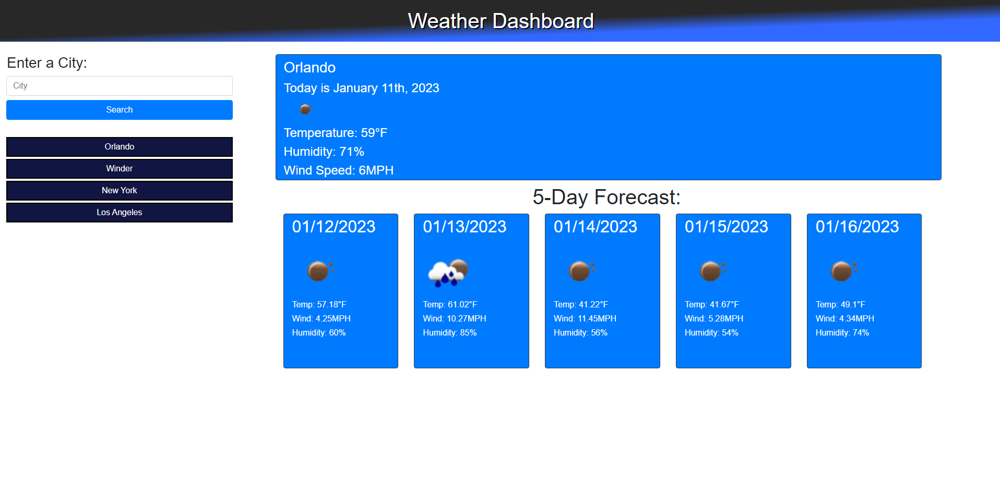

# 5 Day Weather Dashboard

## Description
- Uses 3rd party API's such as OpenWeather and Moment
- Weather dashboard that runs in the browser and features dynamically updated HTML and CSS.
- Using the 5 Day Weather Forecast to retrieve weather data for cities.
- Also uses jQuery and bootstrap to build.

## Screenshot

## Link
https://brughk.github.io/5-Day-Weather-Dashboard/

## Usage
N/A